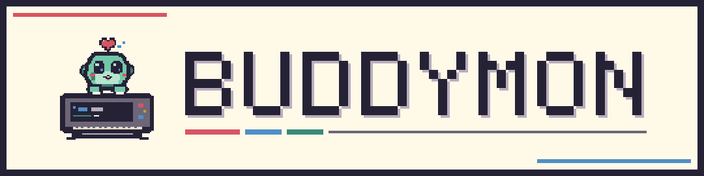
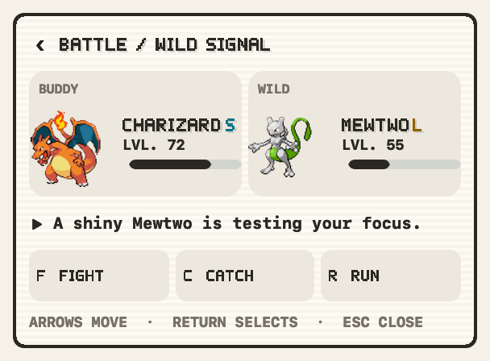
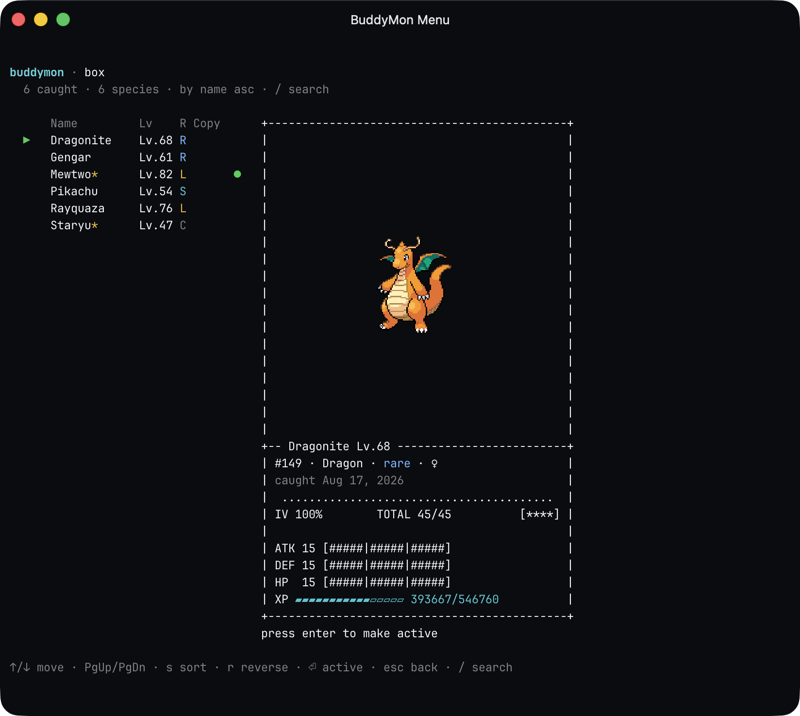
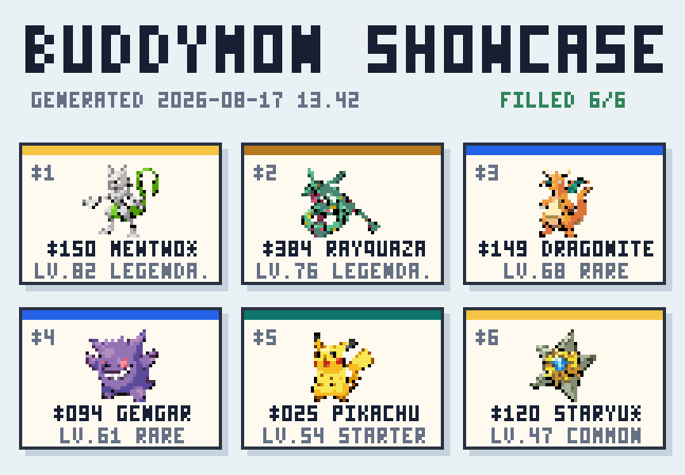

<h1 align="center">
  
</h1>

<p align="center">
  <strong>Turn local AI coding sessions into a Pokémon-style companion game.</strong><br>
  Work, earn XP, meet wild Pokémon, and build a collection that stays on your Mac.
</p>

<p align="center">
  
</p>

<p align="center">
  <sub>The everyday menu-bar view: your buddy, progress, latest catch, and next action.</sub>
</p>

##  Start Playing

Clone BuddyMon once:

```bash
git clone https://github.com/HVNT/buddymon.git ~/buddymon
cd ~/buddymon
```

### Claude Code plugin

Claude Code is the automatic path: plugin hooks turn new Claude activity into
progress without a background service. Launch `claude` and run:

```text
/plugin marketplace add ~/buddymon
/plugin install buddymon@buddymon
/buddymon:choose bulbasaur
```

Other starters are `charmander`, `squirtle`, `pikachu`, and `eevee`. The plugin
invokes `python3`, so Python 3 must be available on `PATH` before Claude starts.

### macOS menu-bar app

BuddyMon `0.2.0` is still unreleased, so there is no downloadable GitHub Release
yet. To try the current self-contained app from source:

```bash
scripts/build-macos-app.sh --friend --install --open
```

The app lives in the menu bar with no Dock icon or account. First Signal lets a
new trainer choose a starter; returning trainers open directly to their buddy.
The public download will be added only after the app passes its signing,
notarization, archive, and clean-install release gates.

##  The Loop

1. Supported local coding activity becomes XP.
2. Your buddy levels up and evolves while you work.
3. Wild encounters appear in Quick, Safari, or Battle mode.
4. Every catch becomes an individual Pokémon with a stable IV appraisal.
5. Choose favorites for your party and six-slot Showcase.

<p align="center">
  
</p>

<p align="center">
  <sub>Encounters and their results stay inside the compact native panel.</sub>
</p>

##  A Collection Worth Opening

Party, Box, Pokédex, Activity, and Showcase open directly in the terminal. On a
roomy display, BuddyMon uses a larger window and larger sprite budget; smaller
displays fall back automatically. Box keeps every caught copy distinct and
supports IV sorting and searches such as `iv:82`, `stars:3`, or `perfect`.

<p align="center">
  
</p>

<p align="center">
  <sub>A real 112-by-38 Ghostty handoff rendered from isolated demo state.</sub>
</p>

Your Showcase is a six-slot trophy room assembled from specific Pokémon in your
Box. Sharing creates a labeled PNG on your Desktop; BuddyMon never uploads it.

<p align="center">
  
</p>

<p align="center">
  <sub>An actual local Showcase export from the deterministic demo collection.</sub>
</p>

##  Works With

| Client | Game progress | Token Usage | Collection path |
| --- | --- | --- | --- |
| Claude Code | Automatic plugin hooks | Yes | Automatic |
| Codex CLI | Local collection | Yes | App, service, or `collect` |
| Auggie | Local collection | Yes | App, service, or `collect` |
| Gemini CLI | No | Yes | Read-only reporting |

The first Codex or Auggie collection anchors existing logs instead of turning
old history into a surprise level-up. Only later activity earns progress.

##  Local by Default

- Normal play reads local transcripts and local BuddyMon state.
- Game state is not uploaded and no BuddyMon account is required.
- AI-tool settings are never rewritten.
- Background collection is opt-in.
- Optional art is downloaded only when you explicitly request it.

State, journey history, and optional packs live under
`$XDG_STATE_HOME/buddymon`, or `~/.local/state/buddymon` when
`XDG_STATE_HOME` is unset.

##  Essential Commands

| Command | Purpose |
| --- | --- |
| `/buddymon:status` | Show the current buddy and encounter |
| `/buddymon:mode <quick\|safari\|battle>` | Change encounter mode |
| `/buddymon:switch <name>` | Change the active buddy |
| `/buddymon:official` | Install optional local art |
| `python3 buddymon.py menu` | Open the terminal game |
| `python3 buddymon.py collect` | Collect new Codex and Auggie activity |
| `python3 buddymon.py tokens` | Show local token totals |

##  Documentation

- [macOS app](docs/macos-app.md)
- [Assets](docs/assets.md)
- [Architecture](docs/architecture.md)
- [Development](docs/development.md)
- [Public release QA](docs/release-qa.md)
- [Troubleshooting](docs/troubleshooting.md)
- [Brand styles](docs/brand.md)
- [Decisions](docs/decisions.md)
- [Changelog](CHANGELOG.md)

## License

MIT. BuddyMon is a fan-made project and is not affiliated with or endorsed by
Nintendo, Game Freak, or The Pokémon Company. Pokémon names and artwork belong
to their respective owners.
