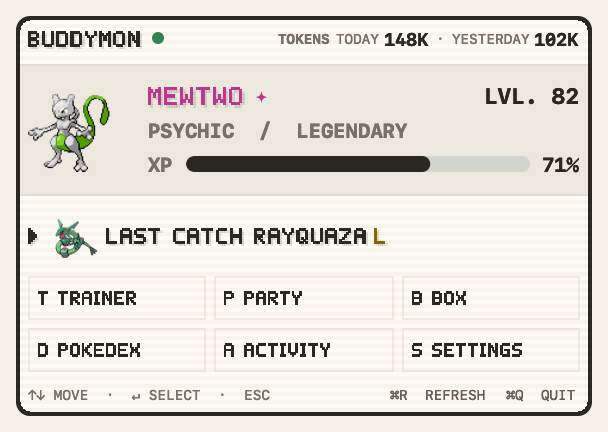
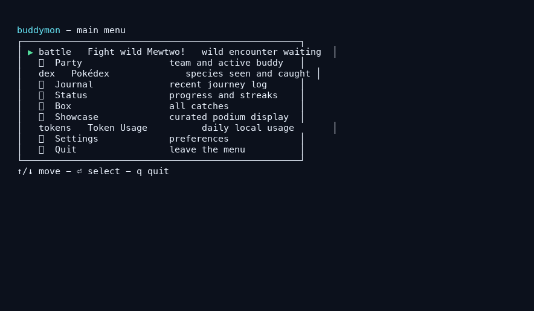
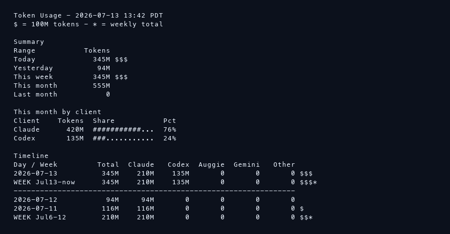

# BuddyMon

BuddyMon turns local AI coding activity into a small Pokémon-style companion.
Its Claude Code plugin automatically turns Claude activity into progress; the
terminal game and local macOS app can also collect Codex CLI and Auggie activity.
Gemini CLI appears in Token Usage only and does not earn game progress.



## Install

### macOS app — Apple silicon

[Download BuddyMon for Apple silicon](https://github.com/HVNT/buddymon/releases/latest/download/BuddyMon-macOS-arm64.zip).

Open the zip, move **BuddyMon.app** to Applications, and open it. First Signal
opens automatically; choose a starter and BuddyMon is ready. No Terminal,
Python installation, account, or optional art download is required.

The app includes its own Python runtime and lives in the menu bar without a
Dock icon or standalone app window. Existing trainers launch quietly; a new
trainer gets the compact First Signal panel after BuddyMon confirms there is no
existing buddy. Built-in fallback art works immediately. Optional art is
downloaded only when you explicitly run `/buddymon:official` or
`install-assets`.

Source builds and release instructions live in
[Development](docs/development.md).

Click the menu-bar buddy for the compact everyday dropdown. A waiting wild
Pokémon becomes its first action; otherwise the panel stays focused on your
buddy, progress, latest catch, compact Token Usage, native Trainer Card, six
quick links, Refresh, and Quit. There is no separate expanded native dashboard.
The Trainer Card includes live mode, streak, ball inventory, shiny count, and
collection-backed achievement badges without inventing a trainer level. It uses
the built-in trainer silhouette unless you explicitly install the optional
local Trainer Red portrait.
Recent catches show their small pixel sprite plus one colored rarity letter.
Waiting encounters, their minimal move buttons, and results stay inside the
same dropdown; arrow keys move and Return or Space selects. Tokens, Today, and
Yesterday form one right-aligned, backgroundless masthead control. Major labels
use the local FireRed/LeafGreen-style pixel face; Refresh and Quit are quiet
`⌘R` and `⌘Q` footer commands.

Trainer opens a native 3:2 card with local collection facts and selectable
achievement medallions. Selecting one replaces the badge heading with its name;
the medallion shows earned or locked state, and its tooltip retains the unlock
requirement. Its subtle motion honors Reduce Motion. Settings opens one native
compact list with all seven preferences. Every allowed option is visible, the
active one is marked, and every change applies immediately. Party, Box,
Pokédex, and Activity remain explicit terminal shortcuts for people who want
them.

The menu-bar buddy is a real game surface, not a static launcher icon. It rests,
works, gains XP, levels, reacts to encounters, catches Pokémon, and plays short
evolution moments. These states use installed local sprite art when available
and the built-in pixel pack otherwise. Reduce Motion shows a representative
static frame.

Local builds are development artifacts, so macOS may ask you to approve them.
Published app archives are built through the signed and notarized release path
documented in [Development](docs/development.md).

### Claude Code plugin — automatic Claude progress

This is BuddyMon's only client-specific plugin. It invokes `python3`; make sure
Python 3 is available on your `PATH` before launching Claude Code. Its hooks
automatically collect new Claude Code transcript activity.

```bash
git clone https://github.com/HVNT/buddymon.git ~/buddymon
cd ~/buddymon
claude
```

Then run:

```text
/plugin marketplace add ~/buddymon
/plugin install buddymon@buddymon
/buddymon:choose bulbasaur
```

Other starters: `charmander`, `squirtle`, `pikachu`, and `eevee`.

## What It Does

- Converts supported local coding activity into XP and levels.
- Starts wild encounters while you work.
- Supports Quick, Safari, and Battle encounter modes.
- Tracks a party, storage box, Pokédex, journal, and token totals.
- Includes a curated Showcase with local PNG sharing.
- Keeps preferences, progress, and history on your machine.






## Works With

| Client | What it contributes | How it reaches BuddyMon |
| --- | --- | --- |
| Claude Code | Progress and Token Usage | Plugin hooks collect activity automatically. |
| Codex CLI | Progress and Token Usage | Run `collect`; the macOS app and optional collector service use it too. |
| Auggie | Progress and Token Usage | Run `collect`; the macOS app and optional collector service use it too. |
| Gemini CLI | Token Usage only | Read-only reporting; it never earns game progress. |

Token Usage is intentionally limited to those four local tools. It does not
guess at unknown sources or show model names unless their local records expose
them reliably.

The first `collect` run only anchors existing Codex CLI and Auggie logs so old
history does not create a surprise level-up. New activity is counted on later
runs.

## Privacy

Normal play reads local transcripts and local BuddyMon state. It does not upload
game state, rewrite AI-tool settings, or require a BuddyMon account.

Network access happens only when you explicitly install or refresh optional art.
The self-contained build may also download its private Python runtime while
packaging. Those Python and Pillow inputs are pinned per architecture and
verified by SHA-256 before use.
Persistent background collection is opt-in through `collector install`.

## Common Commands

| Command | Purpose |
| --- | --- |
| `/buddymon:status` | Show the current buddy and encounter |
| `/buddymon:dex` | Open the Pokédex |
| `/buddymon:history` | Show the journey journal |
| `/buddymon:switch <name>` | Change the active buddy |
| `/buddymon:mode <quick\|safari\|battle>` | Change encounter mode |
| `/buddymon:official` | Install optional art |
| `python3 buddymon.py menu` | Open the terminal menu |
| `python3 buddymon.py collect` | Collect new Codex CLI and Auggie activity |
| `python3 buddymon.py tokens` | Show local token totals |
| `python3 buddymon.py install-assets [--refresh]` | Install optional art |
| `python3 buddymon.py collector install\|status\|uninstall` | Manage background collection |

The collector command creates a per-user LaunchAgent only when you ask for it.
Manual `collect` runs immediately; app and background collection share a
locked five-minute schedule gate.

## Local Data

State, journal history, and optional asset packs live under
`$XDG_STATE_HOME/buddymon`, or `~/.local/state/buddymon` when
`XDG_STATE_HOME` is unset.

## Docs

- [Brand styles](docs/brand.md)
- [macOS app](docs/macos-app.md)
- [Assets](docs/assets.md)
- [Architecture](docs/architecture.md)
- [Development](docs/development.md)
- [Public release QA](docs/release-qa.md)
- [Troubleshooting](docs/troubleshooting.md)
- [Decisions](docs/decisions.md)
- [Changelog](CHANGELOG.md)

## License

MIT. Pokémon names and artwork belong to their respective owners.
