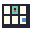
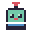
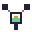

#  Assets

##  Brand Identity

BuddyMon's tracked product identity lives under `docs/assets/brand/`. The
Signal Buddy lockup, standalone mark, semantic documentation icons, and macOS
app icon are hand-pixeled originals generated by
`scripts/render-brand-assets.sh`. They use hard alpha edges, nearest-neighbor
scaling, and the fixed palette documented in [Brand Styles](brand.md).

These repository assets are part of BuddyMon itself. They are separate from
optional Pokémon and trainer packs in local XDG state and never require a
network download.

##  README Visuals

Tracked README images are regenerated with
`python3 scripts/generate-readme-screenshots.py`. The compact panel, encounter,
Trainer Card, and Token Usage images instantiate shipping native views with
deterministic demo state. The Showcase image uses the shipping local PNG
exporter with the same kind of demo collection; it is an export, not a native
panel or a player's personal save.

##  Optional Game Art

Art packs are optional. BuddyMon uses its built-in sprites when they are not
installed.

By default, downloaded packs live in:

```
~/.local/state/buddymon/packs/
```

They include:

- Gen 2 menu icons from `pret/pokecrystal`
- box icons/palettes from PokéSprite-derived sources
- Gen 5 animated sprites from PokeAPI sprite mirrors
- Trainer Red's 64-by-64 front portrait from a pinned `pret/pokefirered` commit

When `XDG_STATE_HOME` is set, BuddyMon uses
`$XDG_STATE_HOME/buddymon/packs/` instead. Packs are local-only; do not commit
their generated JSON.

The compact app never downloads art automatically. From the Claude Code plugin,
`/buddymon:official` asks before installing missing packs. From the CLI, install
only missing packs with:

```
python3 buddymon.py install-assets
```

Refresh every installed pack with:

```
python3 buddymon.py install-assets --refresh
```

Install or refresh only the Trainer Red portrait with:

```
python3 buddymon.py install-assets --only=trainer
python3 buddymon.py install-assets --refresh --only=trainer
```

`--force` remains an alias for `--refresh` for older scripts.

Both commands use the network. A failed install or refresh keeps the last
working copy of each pack.

Runtime uses local Pokémon packs when present and otherwise falls back to the
original sprites in `lib/sprites.py`. The native Trainer Card uses the local
Trainer Red pack when present and otherwise draws BuddyMon's original two-tone
silhouette with `BuddyMonBrand` colors. No external trainer portrait is bundled,
and the app never fetches it without an explicit asset command.

The native status item prioritizes compacted, species-specific Gen 5 frames so
its buddy matches the Pokémon shown in the native panel. If that pack is not
installed, it falls back through box art, Gen 2 menu icons, and built-in art.
Gen 2 menu icons are a legacy fallback because several species share category
icons such as `BIGMON`; they must not replace more recognizable per-species art.

Ghostty and iTerm2 can show inline PNG sprites in the terminal menu. Plain
terminals use terminal-safe pixel art.
