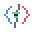

#  Brand Styles

BuddyMon's native brand system is **BuddyMon Brand**. Its primary menu-bar
expression is the **Field Guide** skin. The older **Redline Mono** explorations
survive only in developer previews and the historical Style Archive. This
document is normative.
The single source of truth for implementation is
`macos/BuddyMonApp/Sources/BuddyMonApp/BrandStyle.swift`.

This contract governs the native macOS shell. Terminal, statusline, and
SwiftBar surfaces follow the same semantic color restraint and product voice,
but do not import AppKit tokens.

Terminal handoffs use one of three brand-owned footprints: roomy
`1040-by-680` with a `112-by-38` Ghostty grid, medium `920-by-600` with a
`100-by-34` grid, or compact `760-by-520` with an `88-by-30` grid. The native
panel chooses the largest profile that fits the current display. Roomy terminal
layouts may use larger encounter and collection sprites; compact layouts keep
their original art budget, and content must never overflow the chosen grid.

`BrandStylesPreview.swift` is the living, scrollable reference for shared
components. Product-specific shipping components use dedicated state harnesses;
the compact dropdown is covered by `MenuPanelStateHarnessView.swift`.
`StyleArchivePreview.swift` preserves the three older explorations for history
only; archived values are never implementation tokens. Neither preview is
reachable from the shipping menu-bar panel.

##  Identity Artwork

The **Signal Buddy** is BuddyMon's original product mascot: a round mint
companion with a coral heart antenna, sea-glass muzzle, blueberry outline, and
small sky-blue signal sparks. The primary composition is **Signal Peek**, where
the buddy rises from a friendly retro terminal. Use that composition for the
primary lockup and standalone product mark. The app icon uses **Signal Tile**:
a close-up of the same face and paws over one quiet ledge inside a stepped,
rounded tile. It must stay readable at Dock size and must not compress a full
terminal scene into the icon. Its 16-, 32-, and 64-pixel entries use a dedicated
face-only drawing rather than shrinking the large tile. Supporting compositions
may change the terminal or signal context, but must not redraw the mascot's
face, silhouette, or colors.

Tracked identity artwork uses this exact raster palette:

- warm paper `#F7F1DF` and surface `#FFF9E8`
- deep blueberry ink `#262236`
- mint body `#72C7A9`, mint shadow `#3B826F`, and sea-glass muzzle `#B6E4CF`
- coral signal `#D95462` and sky signal `#4F8FC7`
- supporting grass `#398978`, electric `#D39A2C`, rule `#B9AEBD`, muted
  `#6D6678`, and raised paper `#E7DFC9`

Identity files are deterministic outputs of `scripts/render-brand-assets.sh`.
Keep hard alpha, nearest-neighbor scaling, and the limited palette. Do not use
Pokémon silhouettes or downloaded pack art as BuddyMon's product identity.
This identity palette belongs to the tracked raster artwork and app icon; it
does not add generic native interface meanings or permit local view palettes.

## Foundation

- Use the local FireRed/LeafGreen-inspired bitmap display face for major compact
  labels: mastheads, Pokémon names, dialogue signals, section titles, and
  action labels. It uses light one-pixel strokes, proportional glyph widths,
  open tracking, and a restrained one-pixel shadow without requiring an
  installed or downloaded font.
- Use SF Mono for compact stats, metadata, token values, keyboard help, and
  longer supporting copy.
- Align content left. Keep one stable gutter and content column.
- Use the `04 / 08 / 12 / 20 / 32 / 48 / 72` spacing rhythm. Major preview
  sections use 72 points of vertical separation.
- Use strong outlines, compact labels, mono type, and a stable left gutter.
- Field Guide uses soft grouping and a few rounded tonal surfaces to echo
  handheld-game dialogue and trainer-card layouts. Borders are exceptional,
  not the default container treatment. Redline Mono's archived large-window
  components remain square.
- Terminal character comes from information density, concise labels, keyboard
  syntax, and the reduced-motion-aware blinking block—not a black canvas or
  ASCII decoration on every element.

##  Motion

- Compact screens and drill-ins render completely and immediately. Do not add
  whole-view, card, or row entrance fades, staggers, scale effects, or geometry
  transitions. The panel window animation remains disabled as well.
- Pokémon state playback, sprite motion, badge feedback, and direct control
  hover feedback remain separate brand-owned behaviors. They must honor macOS
  Reduce Motion and must never delay navigation or content visibility.
- Completed encounter moves may replay the dialogue arrow with one short
  horizontal jiggle. Reduce Motion removes the jiggle; the action-specific
  pending copy remains the required feedback in every accessibility mode.

##  Color

The Field Guide dropdown uses warm Pokémon off-white, charcoal ink, and neutral
gray rules. It must remain readable without accent color.

Color must communicate one of these approved meanings:

- Charcoal: interface focus and primary encounter actions.
- Pokemon red: urgent alerts or Fire Pokémon identity, never generic chrome.
- Blue and green: Pokémon identity or the fixed rarity-code palette. Pikachu
  yellow: Electric identity or the game's XP meter.
- Pink: shiny, rare-Pokémon, or shiny-achievement signals only.
- One-letter rarity markers use one fixed mapping: common neutral, uncommon
  green, rare blue, legendary gold, mythic pink, and starter cyan.
- Pokemon sprites and the selected emoji set may keep their native color.

Do not color generic interface furniture, ordinary success states, or arbitrary
categories. Views choose semantic tokens such as `focus`, `alert`,
`xpProgress`, `dataProgress`, and `pokemonColor`; they do not choose colors by
appearance.

##  Required Workflow

All shipping native UI must use `BuddyMonBrand`. Never add a local palette,
theme enum, hard-coded `NSColor`, direct font choice, one-off corner radius, or
new spacing rhythm inside a view.

When a native visual decision changes:

1. Add or change the token or shared treatment in `BrandStyle.swift` first.
2. Use that token from the shipping view.
3. Add every relevant state and variation to the shared preview or the
   product-specific shipping-component harness.
4. Update this document and `docs/decisions.md` if the meaning changed.
5. Update the native source tests so visual drift fails locally.

Prefer `makeSurface`, `makeButton`, `makeField`, `makeControlLabel`,
`pokemonColor`, and the semantic spacing roles before writing view-specific
treatment code. Compact-dropdown work uses `BuddyMonBrand.Menu`, including its
surface, action, progress, Pokémon-color, spacing, and geometry tokens. The
visual harness must render the shipping component rather than a lookalike.

`StyleArchivePreview.swift` is the only exception: it keeps old local colors
and geometry as read-only historical evidence. No new UI may copy from it.

The compact menu-bar panel is the primary everyday product expression of the
system. Its Field Guide hierarchy is header, tonal buddy group, one-line field
message, essential actions, compact utilities, then keyboard help. Recent-catch
signals include the actual small Pokémon sprite. Compact encounter drill-ins
use two sprite identities, optional HP bars, one dialogue line, one move row,
and a single compact result. Keep Pokémon identity and the current signal ahead
of setup or repair controls. No expanded native dashboard is part of the
shipping product surface.
Encounter moves are single-flight. Selecting one immediately replaces the
dialogue with action-specific working copy, keeps the selected move visually
primary, disables every move until the response returns, and restores focus to
that move when the encounter continues. Back, Escape, and closing the panel
remain available; a late response never reopens a panel the player left.

The latest-catch row starts with its chevron at the content edge, then uses
explicit spacing columns for the caught sprite, neutral-ink `LAST CATCH` label,
Pokémon name, and rarity. Do not hide alignment inside spaces in one string.
A single rarity code follows the Pokémon name: `C`, `U`, `R`, `L`, `M`, or `S`.
Only that code uses the rarity's semantic color.
Battle identity rows and encounter results use the same rule: Pokémon names and
outcome copy stay neutral, with one adjacent rarity code carrying the color.

The compact panel is 304 points wide. Root navigation uses six real accessible
controls styled as links in a square 3-by-2 grid. Each link is 22 points tall,
has no corner radius or resting button fill, and keeps one subtle neutral rule.
Hover adds a quiet surface wash and one-point lift over 120 milliseconds;
Reduce Motion keeps the link stationary. Primary and encounter actions retain
the standard 32-point button treatment.
First Signal uses the standard 304-by-210 Field Guide frame. Five starter
choices use the same 22-point quick-link treatment in a 3-by-2 grid, with one
small identity-color mark and neutral action text. Its working and error states
remain in that frame; setup never switches to the historical dark console skin
or a larger window.
The compact root, Token Usage, Settings, Battle, and Battle Result stacks sit
inside the same 288-point striped Field Guide frame used by the Trainer Card,
leaving an eight-point canvas reveal on each side. Their existing hierarchies
stay intact; one shared border, surface, section rhythm, and dark display
masthead provide the card-like structure without adding nested containers. The
root view uses the shared six-point compact inset at its outer edge; drill-ins
retain their ten-point content inset.
Token Usage keeps the standard 304-by-210-point compact panel size while its
local report loads, after it resolves, and if the report fails. Loading and
failure render inside the Field Guide card; they never install a standalone
Redline surface as an intermediate frame. Its resolved hierarchy is
two equal comparison cards, a seven-day pulse with proportional daily bars, one
context line for daily average, peak day, and active streak, then supported-tool
share. The first card compares Today with Yesterday; the second compares This
Week with Last Week. Each card keeps its change percentage beside its title and
the earlier period below the primary total. The pulse and context use the
structured local dashboard payload; they do
not parse or duplicate terminal report copy. The pulse is 52 points tall so its
27-point drawable bar range uses the report's available vertical space while
the panel remains 304 by 210 points. Because Token Usage is read-only,
it has no generic arrow/Return instruction footer; the supported-tool share is
its final bottom-anchored row, while Back and Escape remain available through
the shared navigation behavior.
Settings uses that same 304-by-210 contract for loading, all-preferences, and
unavailable states. All seven preferences appear directly in one list using a
shared treatment with a leading label and every allowed value visible on the
same 18-point row. Each value is an individual text control with no resting fill or
rounded button chrome. The active value uses darker bold type, an underline,
and a leading chevron; inactive values remain muted. Every option owns its full
pointing-hand hit target, hover may add a transient wash, and keyboard focus
uses a square ink outline. Clicking an option or pressing Return sets that exact
Python-validated value immediately and refreshes the list in place. Operational
actions such as backup and setup do not masquerade as preferences.
Every compact drill-in that returns to the root panel uses one navigation treatment:
back chevron and display title on the same leading row, followed only by useful
trailing context such as the Trainer ID. The back control remains first in the
keyboard order; separate bottom Back or oversized Return Home actions are not
used.
The Trainer drill-in uses a 288-by-192-point, 3:2 card inside that panel. Its
striped Field Guide surface contains one header, four fact rows, BuddyMon's
original two-tone trainer silhouette, a four-star badge-rank summary, one
compact trainer-status rail, and one badge rail. The status rail turns the
former blank middle band into four current, trainer-owned readouts: encounter
mode, activity streak, available balls, and owned shiny count. Battle mode
reports unlimited balls instead of implying that Safari inventory is consumed. Its 26-point
shared treatment uses equal-width cells on a quiet raised surface with subtle
top and bottom rules; it adds no nested card or new accent color. The rail is
the deliberate exception to the drill-in's ten-point content gutter: it spans
the full 288-point card and meets the black border on both sides, while its four
stat columns remain centered on the card.
It uses the same shared surface, type, spacing, and badge treatments as the
shipping view. Nine badges are represented before National completion. Shiny
National is omitted, not shown as a locked teaser, until National is earned;
the National-complete harness state shows the resulting tenth position. Badge
symbols sit centered inside 28-point circular medallions; the ten-badge state
uses 25-point medallions so every center remains on one even rail. Text glyphs
use the shared zero-offset center alignment so their visible shapes sit on the
circle's center. Opening the card gives each medallion a
short staggered stamp, hovering gives it a slight lift, and earned shiny badges
carry a slow low-opacity glow. All three motions are disabled by macOS Reduce
Motion.
Each medallion is also a real keyboard and pointer control. Selecting it replaces
the rail's left-side `BADGES` heading with the badge name; the medallion styling
already communicates earned or locked state, while tooltips retain the full
name and requirement. The badge header's right side shows `RANK` and four stars:
each star represents two of the eight core badges, not a trainer level. The fact
grid uses fixed label and value columns, while the portrait owns one separate
trailing column. The status rail occupies the
space between those facts and the bottom-anchored badge rail; flexible space is
used only as a compatibility fallback for older payloads that do not provide
trainer stats, and never appears below the badge rail.
The Trainer Card may show the explicitly installed local Trainer Red portrait.
Without that pack, it draws BuddyMon's original two-tone silhouette directly
with shared `BuddyMonBrand` ink colors. No external trainer portrait is bundled;
both states keep the same portrait geometry and surrounding card treatment.
Inside the buddy identity column, the level and XP percentage share the same
right edge. The XP bar flexes to fill all space between its label and value.
The active-buddy group is a full-width raised row inside the Field Guide frame.
It has square edges, no outer left or right inset, and only low-opacity one-point
rules on its top and bottom. One six-point inner padding layer keeps its
54-point Pokémon sprite aligned with the three-row identity stack, producing a
fixed 66-point row. Panel minimum-height slack must never stretch that bottom
perimeter. There is no nested background or rounded sprite well.

When a wild is waiting, its field message and primary action collapse into one
dark clickable row with the wild sprite, shortcut, name, and waiting state. Do
not repeat the encounter as a separate signal line above it. The sprite owns a
dedicated 24-point leading column inside the row padding; it must never overlap
or crop the shortcut and label.

The root masthead stays visually subordinate and begins directly with the small
FireRed/LeafGreen-style `BUDDYMON` wordmark—there is no decorative leading icon.
A steady six-point semantic status dot follows it: green when the app has an
active local status, red when local status is unavailable, and neutral only
while status is starting or loading. It does not blink. The far-right side is the complete clickable
token summary: Tokens, Today, and Yesterday on one right-aligned baseline with
no background, no separate Open label, and no second token card. The Tokens
label stays smaller than its values. Refresh and Quit render as tiny `⌘R` and
`⌘Q` footer commands, never as raised action cards. The buddy card ends after
XP; trainer totals do not consume a separate row.

The status item comes before either panel. Its frame art may preserve Pokémon
color, but its text and macOS interaction chrome remain system-native. It uses
the shared `menuBarIconHeight` geometry token, never template-tints sprite art,
and exposes an accessibility label for every frame. When local Gen 5 art is
installed, the status item and panel use that same species-specific source;
shared legacy menu icons never displace more recognizable art. Short motion may
communicate work, progress, encounters, catches, and evolution; persistent
states settle, and every sequence defines a Reduce Motion frame. Catch motion
may show the wild Pokémon during the action, but its result settles back on the
active buddy. The caught Pokémon remains identifiable in the compact panel's
recent-catch signal. Attention states draw one integrated alert mark in the
frame and do not repeat the same `!` as adjacent status-bar text. Working state
is communicated by the buddy's quiet bob alone, without an adjacent bullet.
When the dropdown opens, it snapshots the status item's screen-space anchor.
Refreshes, animation frames, and compact drill-ins reuse that anchor until the
panel closes; the next closed-to-open transition captures a fresh position.

##  Visual QA

Capture the entire scrollable reference as a PNG:

```bash
scripts/capture-brand-styles.sh
scripts/capture-menu-bar-states.sh
scripts/capture-menu-panel.sh
scripts/capture-menu-panel-states.sh
```

The outputs are `.build/brand-styles.png`,
`.build/menu-bar-state-harness.png`, `.build/menu-panel.png`,
and `.build/menu-panel-states.png`. The menu-bar harness uses
the shipping local-first art path and deterministic state fixtures; the compact
panel capture reads local `app-status`; the compact-panel harness covers no
starter, compact First Signal, flow loading/error, ready, recent, encounter,
shiny, long-value, unavailable, state-recovery-required, Tokens,
all-preferences Settings and Settings loading, minimal battle, caught and ran-away battle
results, local-portrait Trainer, and National-complete Trainer states. None
changes game state. The macOS test suite renders these surfaces twice and requires
byte-identical output and their canonical dimensions. It also enforces the
component inventory and contrast rules.

##  Review Checklist

- The screen and every component are left aligned.
- Section spacing follows the shared rhythm and remains comfortably scannable.
- Default chrome stays neutral; every accent color must have an approved
  identity, rarity, progress, or alert meaning.
- Focus, error, loading, and destructive meaning is never communicated by
  color alone; pair it with borders, symbols, copy, or motion.
- Keyboard focus, disabled, loading, empty, error, selected, and destructive
  states are represented where applicable.
- Emojis, built-in pixel fellows, and optional local PNG sprites appear in a
  common product context when the component needs Pokemon identity.
- Motion honors Reduce Motion, and shortcuts use macOS keys rather than PC
  function-key conventions.
